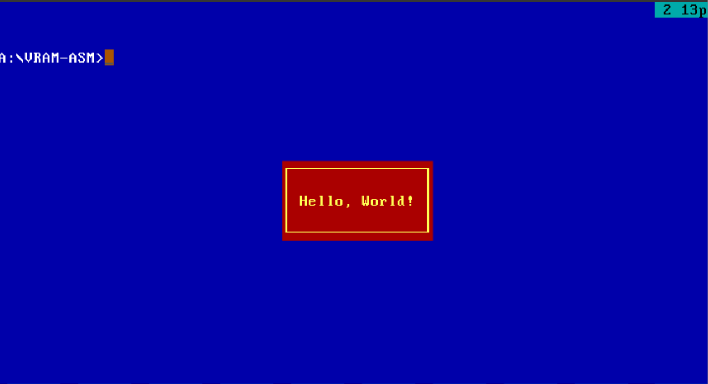
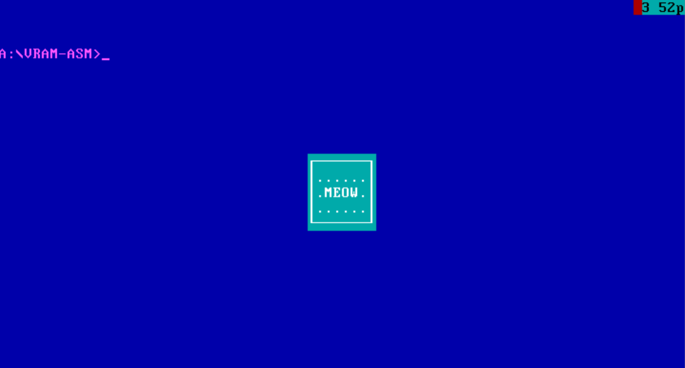
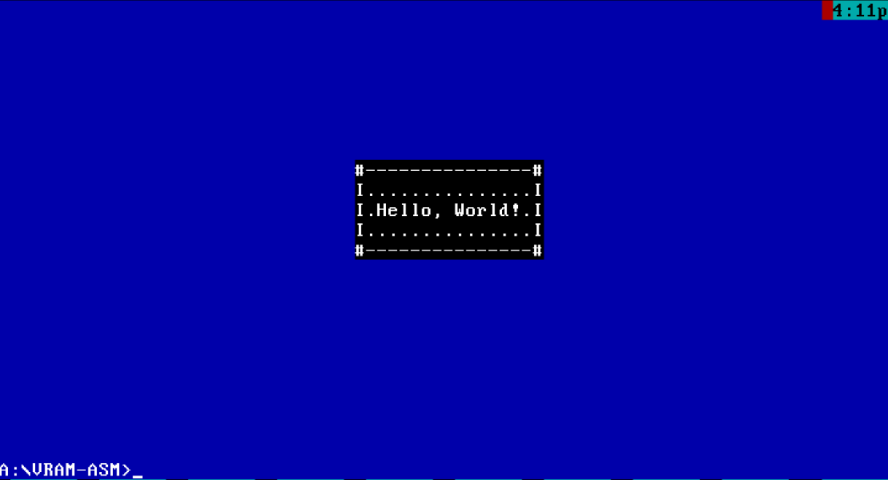

# Assembly DOS Tasks (TASM)

This repository was created to study assembly in DOS

|      Имя       |       Расположение      |        Описание         |
| -------------- | ----------------------- | ----------------------- |
| Framed message | [vram-asm](./vram-asm/) | Вывод сообщение в рамке |

## Examples of work

### String in frame

Usage: file.com [BG] [TXT] [Fill] [Flag] [7Chars if Flag=1] [Message]


*Пример 1. Вызов программы без передачи параметров: ```file.com```*


*Пример 2. Запуск с параметрами: ```file.com 1F 4E ♥ 0 Hello, World!```*


*Пример 3. Запуск с параметрами: ```file.com 1D 3F . 0 MEOW```*


*Пример 3. Запуск с параметрами: ```file.com 1F 0F . 1 #I#-#I# Hello, World!```*
