# Assembly DOS Tasks (TASM)

This repository was created to study assembly in DOS

|      Имя       |       Расположение      |        Описание         |
| -------------- | ----------------------- | ----------------------- |
| Framed message | [vram-asm](./vram-asm/) | Вывод сообщение в рамке |

## Examples of work

### String in frame

Usage: file.com [BG] [TXT] [Fill] [Flag] [7Chars if Flag=1] [Message]

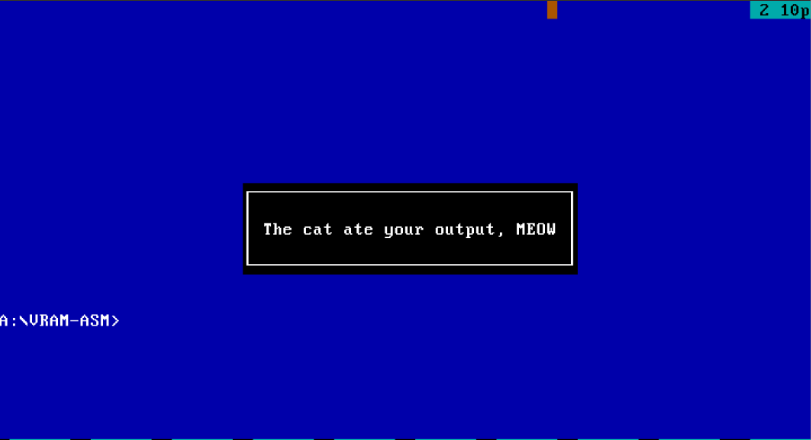
*Пример 1. Вызов программы без передачи параметров: ```file.com```*

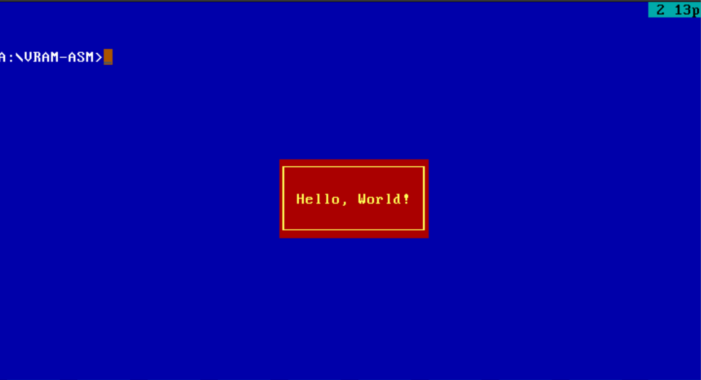
*Пример 2. Запуск с параметрами: ```file.com 1F 4E ♥ 0 Hello, World!```*

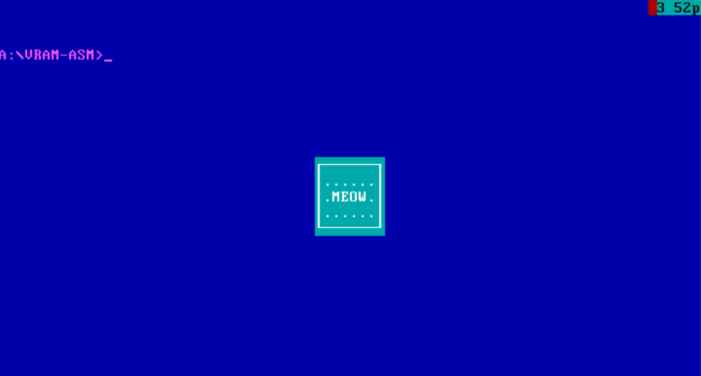
*Пример 3. Запуск с параметрами: ```file.com 1D 3F . 0 MEOW```*

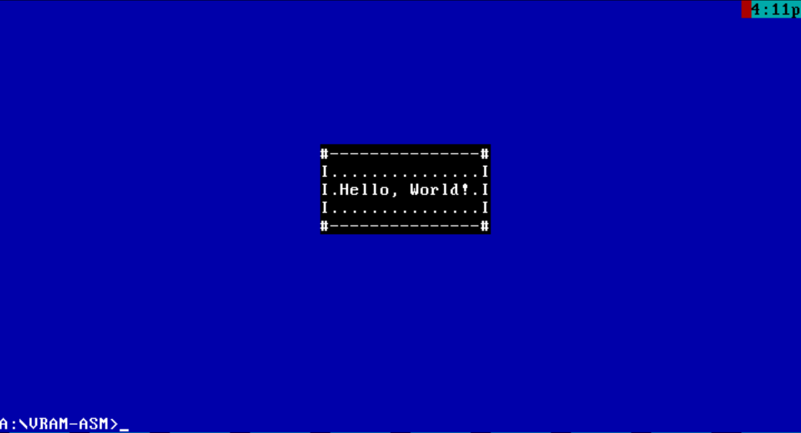
*Пример 3. Запуск с параметрами: ```file.com 1F 0F . 1 #I#-#I# Hello, World!```*

### Registers View TSR

Usage: file.com [TXT] [Fill] [Flag] [7Chars if Flag=1]

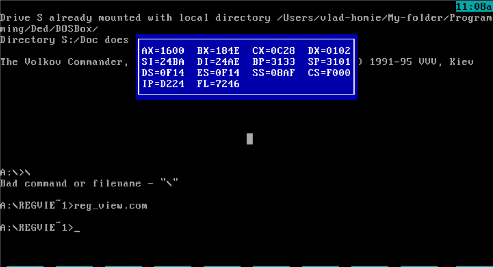
*Пример 1. Запуск без параматров: ```file.com```*

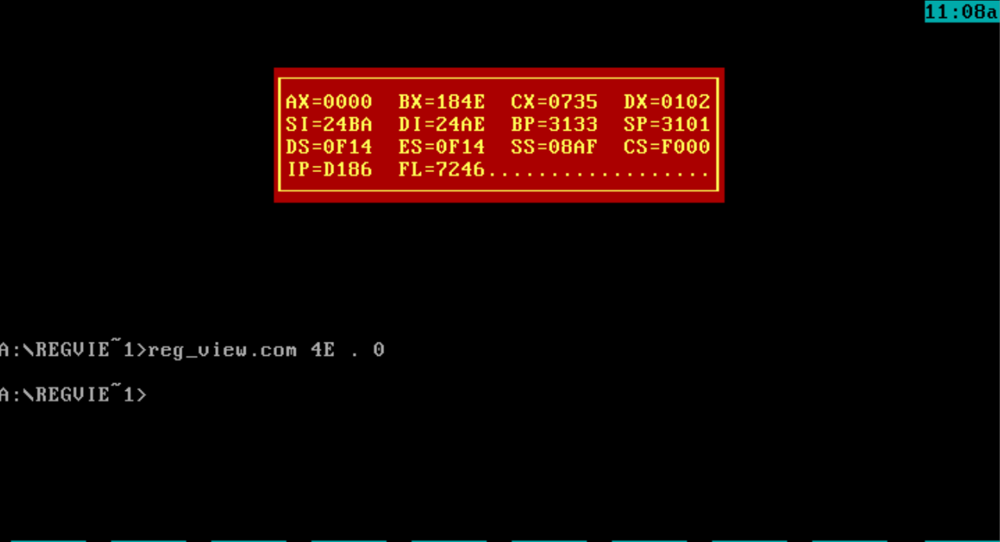
*Пример 2. Запуск с параматрами без кастомной рамки: ```file.com 4E . 0```*

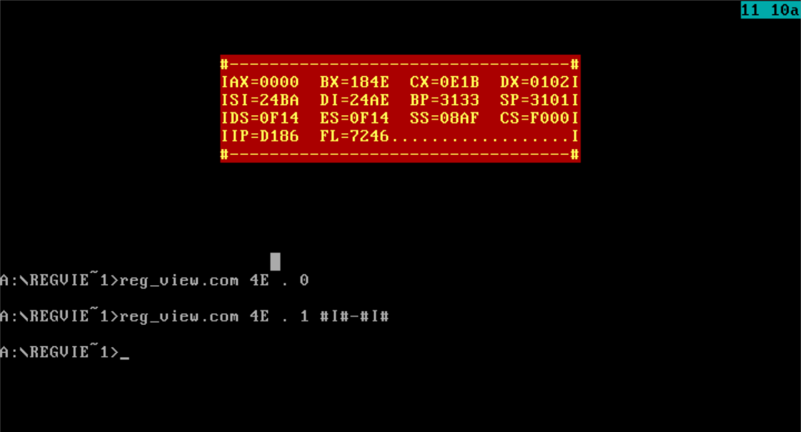
*Пример 3. Запуск с параметрами и кастомной рамкой: ```file.com 4E . 1 #I#-#I#```*


## CRACKME

В [папке](crackme/) храняться 2 моих программы, в каждой из которых заложены по одной уязвимости.

Далее пойдет рассказ про то, как я взламывал crackme-шки, которые мне дала Ирина.

### crackme-easy

Суть уязвимости: программа считывает ввод пользователя в буфер, расположенный в области данных. Сразу за этим буфером находится переменная-флаг, отвечающая за статус доступа. Из-за отсутствия проверки границ ввода, мы можем "дотянуться" до этого флага и изменить его значение на ходу.

Ход взлома:
1) Анализ работы программы

    Программа выводит приглашение к вводу, считывает данные и вызывает функцию хэширования. Далее идет сравнение сохраненного и вычисленного хэшей, результат записывается в флаг доступа. Далее выполняется проверка этого флага

2) Анализ уязвимости

    Уязвимость обнаружилась в параметрах чтения данных и структуре хранения данных. Инструкция ```mov dx, 1ACh``` указывает адрес буфера, а ```mov cx, 0FFh``` позволяет записать туда до 255 байт. 

    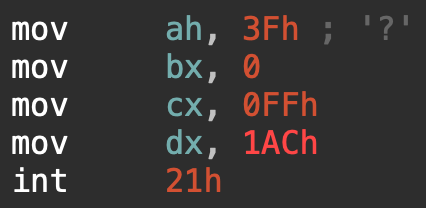
    *Рисунок Easy1. Параметры функции чтения: буфер на ```1ACh```, размер 255 байт*

    Если посмотреть на структуру данных, я увидел, что по адресу ```1BCh``` (через 16 байт после после начала буфера) лежит флаг доступа.

3) Как будем взламывать?

    Так как программа сначала читает ввод (и затирает память), а уже потом проверяет флаг, нам достаточно подать на вход строку, которая:
    * Полностью заполняет буфер ввода (16 байт).
    * 17-м байтом записывает «1» (или любой ненулевой символ) прямо в ячейку памяти, где лежит флаг доступа.

    Итоговая строка: ```AAAAAAAAAAAAAAAAX```, где 16 символов A заполняет буфер ввода, а символ X перезаписывает флаг доступа на ненулевой.

### crackme-hard

Суть уязвимости: программа выделяет под пароль маленькое место, но позволяет положить на это место огромный кусок памяти. Лишние данные не помещаются и начинают затирать служебную информацию.

Ход взлома: 

1) Анализ работы программы

    Программа выводит строку "Please, enter the password:", после вызывает функцию проверки пароля и, в зависимости от результата в ```AX``` прыгает на "Access granted" или "Access denied".

    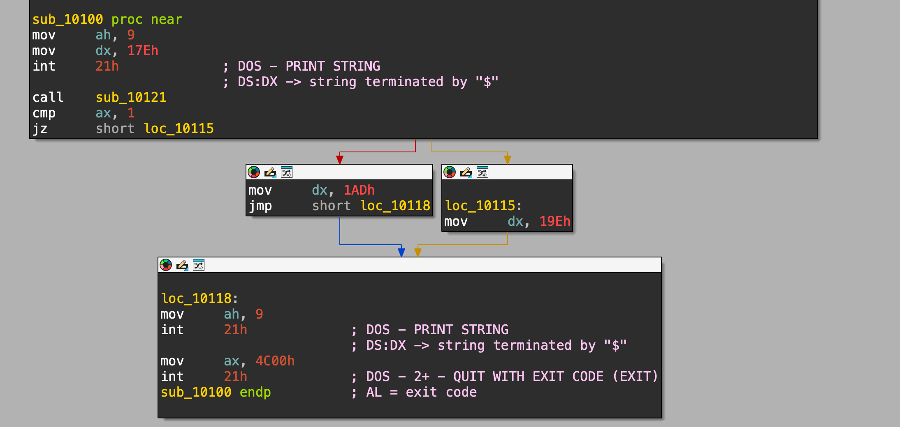

2) Анализ работы функции ввода пароля

    Программа выделяет 16 байт на стеке (```sub sp, 10h```) и читает ввод пользователя. И именно здесь была заложена уязвимость: на стеке резервируется 16 байт, но при этом программа разрешает функции 21-го прерывания записать до 255 байт.

    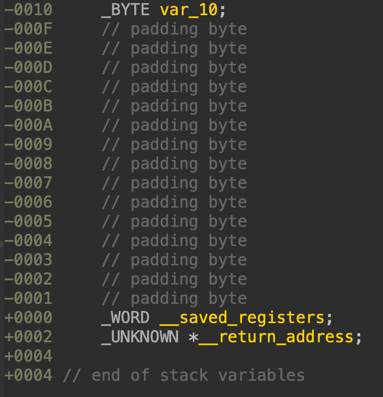
    *Рисунок Hard1. Стек функции ввода пароля*

    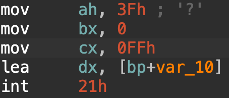
    *Рисунок Hard2. ```mov cx, 0FFh``` показывает, что задается максимальный размер для чтения - 256 байт*
    
    Далее идет вызов функции хэширования для введенного пароля, сравнение полученного и сохраненного хэшей.

3) Как будем взламывать?

    Мне было необходимо составить такую строку (пароль), обладающая следующими свойствами:
    * заполняет буфер (16 байт)
    * перезаписывает сохраненный регистр ```BP``` 
    * перезаписывает адрес возврата на тот адрес, который ведет к выводу "Access granted"

    Получилась такая строка - ```AAAAAAAAAAAAAAAAAARR```, где RR - байты адреса, в нашем случае ```1501```.